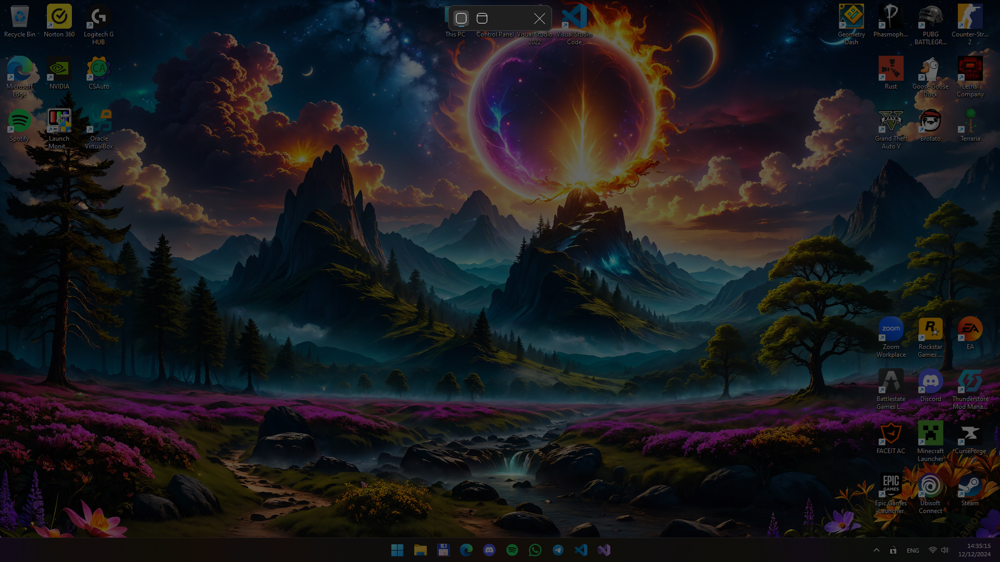
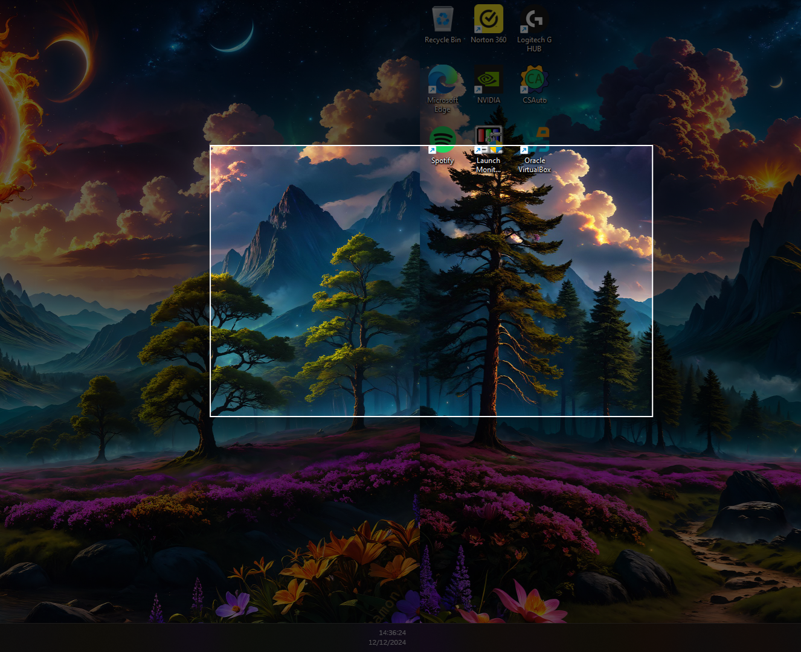
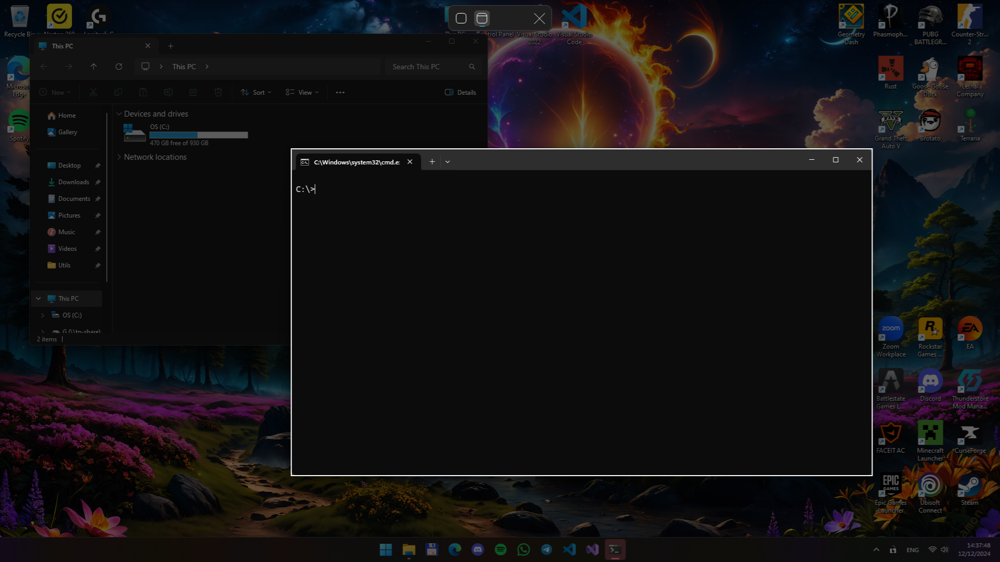

<h1> ScreenEx </h1>

<b>ScreenEx</b> is a Windows application that is useful for screenshotting a part of your screen

 To start capturing a new screenshot press <code>Ctrl + Alt + S</code>

### Feautres

- Regular screenshot with a rectangle selection
- Multi-monitor selection area
- Screenshotting an area of a specific window
- Capturing the screen when resolution is different then the desktop one `(unlike Snipping Tool)`
- Saving screenshots to clipboard
- Saving screenshots to a folder `(%UserProfile%\Pictures\ScreenEx)`

### Screenshots

